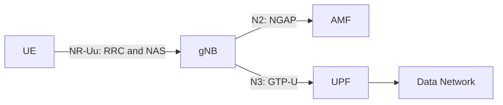
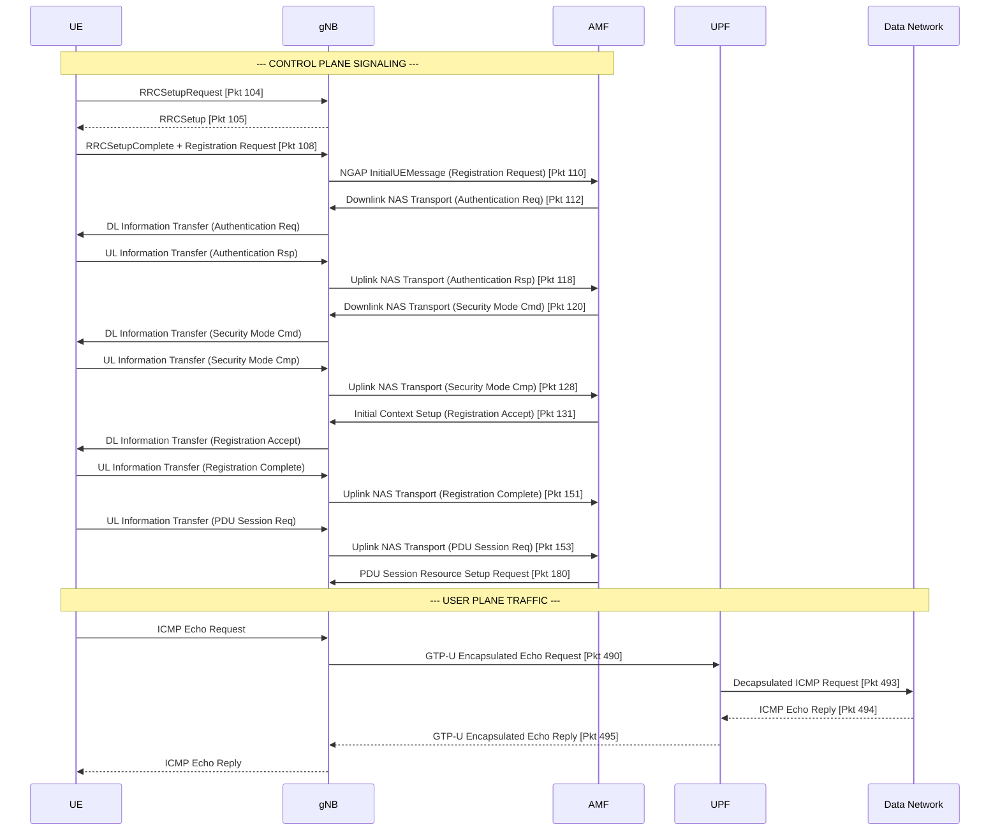

# Lab 1: Analyzing UE–gNB Connectivity in an OAI 5G SA Network

## 1. Lab Overview

In this lab, you will use Wireshark to analyze how a UE establishes an RRC connection with an OAI gNB and then registers with the 5G Core.

The main signaling path is:

```text
UE
→ RRC connection establishment
→ NAS Registration Request
→ gNB forwards the NAS message through NGAP
→ 5G Registration
→ PDU Session establishment
→ UE obtains an IP address
→ User-plane connectivity test
```

This lab focuses on the relationship between the UE and gNB. Internal 5G Core procedures such as detailed SBI and PFCP signaling are outside the main scope.

### Learning objectives

After completing this lab, you should be able to:

1. Identify the UE, gNB, AMF, UPF, and Data Network.
2. Explain the purpose of `RRCSetupRequest`, `RRCSetup`, and `RRCSetupComplete`.
3. Explain how a NAS message is transported from the UE to the AMF through the gNB.
4. Identify the main 5G Registration messages.
5. Verify that the UE receives an IP address and exchanges user-plane traffic.

## 2. Required Files

You need the following files:

- `OAI-5G-Wireshark-Profile.zip`
- `oai-5g-combined.pcapng`

The capture contains both:

- OAI-generated RAN packets for MAC-NR and NR-RRC analysis
- Core-network packets for NGAP, NAS-5GS, GTP-U, and ICMP analysis

---

## 3. Install the OAI-5G Wireshark Profile

### 3.1 Ubuntu or Linux

Close Wireshark and extract the profile:

```bash
mkdir -p "$HOME/.config/wireshark/profiles"

unzip OAI-5G-Wireshark-Profile.zip \
  -d "$HOME/.config/wireshark/profiles"
```

Verify the profile directory:

```bash
ls "$HOME/.config/wireshark/profiles/OAI-5G"
```

### 3.2 Windows

1. Close Wireshark.
2. Press `Win + R`.
3. Enter `%APPDATA%\Wireshark\profiles`.
4. Create the `profiles` directory if it does not exist.
5. Extract the ZIP file into that directory.

The final directory should look like:

```text
%APPDATA%\Wireshark\profiles\OAI-5G\preferences
%APPDATA%\Wireshark\profiles\OAI-5G\enabled_protos
%APPDATA%\Wireshark\profiles\OAI-5G\disabled_protos
%APPDATA%\Wireshark\profiles\OAI-5G\heuristic_protos
```

Do not add an extra directory level around `OAI-5G`.

## 4. Open and Verify the Capture

1. Start Wireshark.
2. Select `Edit → Configuration Profiles → OAI-5G`.
3. Open `oai-5g-combined.pcapng`.
4. Enter this display filter:

```wireshark
nr-rrc
```

You should see NR RRC messages.

If packets are incorrectly displayed as TP-Link traffic, verify:

```text
Edit → Preferences → Protocols → UDP
→ Enable “Try heuristic sub-dissectors first”

Analyze → Enabled Protocols
→ Enable mac_nr_udp
→ Disable tplink-smarthome
```

> The RAN packets appear as `127.0.0.1:9999 → 127.0.0.1:9999`. These are synthetic packets generated by OAI for Wireshark analysis. They are not the actual network addresses of the UE and gNB.

### Checkpoint 1: Wireshark Setup — 10 points

Submit:

- A screenshot showing that the `OAI-5G` profile is selected. — 3 points


- A screenshot showing the opened capture. — 2 points


- A screenshot showing NR RRC packets after applying `nr-rrc`. — 5 points


---

## 5. Identify the Basic 5G SA Architecture

Use:

```text
Statistics → Endpoints → IPv4
```


Apply these filters individually:

```wireshark
ngap
```


```wireshark
gtp
```


```wireshark
icmp
```


Complete the table:

| Component | IP address | Evidence from the capture |
|---|---|---|
| UE PDU address | 10.0.0.2 | Src from the ICMP Echo requests (ex: Pkt 460) |
| gNB | 192.168.70.129 | Source IP address of the NGSetupRequest message |
| AMF | 192.168.70.132 | Destination IP address of the NGSetupRequest message |
| UPF | 192.168.70.134 | Dst IP address for Router Sollicitation (Pkt 211) |
| Data Network | 192.168.70.135 | Destination IP address of the ICMP Echo requests sent by the UE |

Complete the interface table:

| Interface | Connected components | Main protocol | Purpose |
|---|---|---|---|
| N1 | UE and AMF | NAS-5GS | Authentication and session management |
| N2 | gNB and AMF | NGAP | Control-plane signaling between the radio network and the 5G core |
| N3 | gNB and UPF | GTP-U | User-plane tunnel to carry UE internet traffic |

The logical architecture is:



### Checkpoint 2: Basic Architecture — 10 points

- Correctly identify the five components and their IP addresses. — 5 points
- Correctly explain N1, N2, and N3. — 5 points

---

## 6. Analyze the RRC Connection Establishment

Apply:

```wireshark
nr-rrc
```

Find the following messages in order:

1. `RRCSetupRequest`


2. `RRCSetup`


3. `RRCSetupComplete`


You may also try these specific filters:

```wireshark
nr-rrc.rrcSetupRequest_element
```

```wireshark
nr-rrc.rrcSetup_element
```

```wireshark
nr-rrc.rrcSetupComplete_element
```

Complete the table:

| Message | Direction | Logical channel / SRB | Main purpose | Packet number |
|---|---|---|---|---:|
| RRCSetupRequest | UE to gNB | UL-CCCH / SRB0 | Ask the gNB to establish an RRC connection, provide the initial UE identity and establishment cause | 104 |
| RRCSetup | gNB to UE | DL-CCCH / SRB0 | Accept the UE's request, send the configuration parameters to create SRB1 | 105 |
| RRCSetupComplete | UE to gNB | UL-DCCH / SRB1 | Confirm the RRC's establishment, send the Registration Request | 108 |

Answer the following questions:

1. **What is the establishment cause in `RRCSetupRequest`?**
   The establishment cause is `mo-Signalling`, as we can see in the screenshot of the RRCSetupRequest. It means that the UE is asking the network for a radio connection so that it can send a control message to the core network.

2. **What SRB does `RRCSetupRequest` use? Why?**
   It uses SRB0 because at this stage, the UE doesn't have a dedicated channel yet, so it uses the Common Control Channel in order to send it's connection request.

3. **Which side sends `RRCSetup`?**
   The gNB sends this packet to the UE in response to it's RRCSetupRequest packet to tell it how to configure it's radio.

4. **Which signaling radio bearer is used after the RRC connection is established?**
   SRB1. Since the RRC setup has been established, the UE and gNB can now communicate in an encrypted channel dedicated to RRC and NAS control messages and don't need to use the default SRB0 anymore.

5. **Which NAS message is carried inside `RRCSetupComplete`?**
   If we look at the Info column for packet 108 in the screenshots, we can see that it says RRC Setup Complete, Registration request. This is the 5GMM Registration Request.

6. **At the end of this procedure, is the UE only connected to the gNB, or is it already registered with the 5G Core? Explain.**
   It is only connected to the gNB. Only the wireless bridge is built between the UE and the gNB, but the gNB still needs to forward the request to the 5G Core (AMF), check the UE's SIM credentials, establish security keys and accept the registration.

### Checkpoint 3: RRC Connection Establishment — 35 points

- Identify all three RRC messages with packet numbers and screenshots. — 12 points
- Correctly identify message directions. — 6 points
- Correctly identify UL-CCCH, DL-CCCH, SRB0, and SRB1 usage. — 7 points
- Explain the purpose of each message. — 6 points
- Explain the difference between RRC connection and 5G Registration. — 4 points

---

## 7. Connect RRC Signaling to NGAP and NAS

The UE exchanges NAS signaling with the AMF through the gNB. On the radio side, the NAS message is carried by RRC. The gNB then forwards it to the AMF through NGAP.

First, locate `RRCSetupComplete` using:

```wireshark
nr-rrc
```

Expand:

```text
RRCSetupComplete
→ dedicatedNAS-Message
→ Registration Request
```


Then apply:

```wireshark
ngap && nas-5gs
```

Locate:

```text
InitialUEMessage
→ NAS-PDU
→ Registration Request
```


Compare the two packets:

| Stage | Protocol message | Sender → receiver | Encapsulated information |
|---|---|---|---|
| Radio side | RRCSetupComplete | UE → gNB | dedicatedNAS-Message (5GMM Registration Request) |
| Core side | NGAP InitialUEMessage | gNB → AMF | NAS-PDU (5GMM Registration Request) |

Finally, locate:

- Registration Accept

This NAS message is encrypted, since the network already established security keys at this point, so we can't directly see the 'Registration accept message'. It is however contained in this packet (131).

- Registration Complete

This NAS message is also encrypted, but we can deduce that it contains the Registration complete message since it is the encrypted uplink message sent immediately following the accept. So, the Registration complete is in this packet (151). 

Answer:

1. **What is the role of the gNB when it transports NAS messages?**
   The gNB acts as a middleman between the user device and the core network. It receives the NAS message from the UE embedded in a radio frame (RRC). It then extracts it and repacks it into a wired core-network message (NGAP) to send to the AMF.

2. **What is the difference between RRC and NAS signaling?**
   RRC (Radio Resource Control) handles the physical wireless connection and radio bearer configurations strictly between the UE and the gNB. NAS (Non-Access Stratum) handles the logical control plane between the UE and the 5G Core (AMF) for overarching tasks like network registration, security authentication, and IP session management.

3. **Is the Registration Request delivered directly from the UE to the AMF? Explain the protocol path.**
   No, The UE places the NAS Registration Request inside an `RRCSetupComplete` message and transmits it over the radio link to the gNB. The gNB receives it, extracts the NAS payload, places it inside an NGAP `InitialUEMessage`, and forwards it over the wired N2 interface to the AMF. 

4. **Which message confirms that Registration has completed successfully?**
   The `Registration Complete` message confirms the process is finished successfully. While the network sends a `Registration Accept` to approve the UE, the final `Registration Complete` is sent by the UE back to the core network to acknowledge that the setup is fully finalized.

### Checkpoint 4: RRC-to-NGAP/NAS Mapping — 25 points

- Show the Registration Request inside `RRCSetupComplete`. — 6 points
- Show the Registration Request inside NGAP `InitialUEMessage`. — 6 points
- Correctly complete the mapping table. — 5 points
- Explain the roles of RRC, NGAP, NAS, gNB, and AMF. — 5 points
- Identify Registration Accept and Registration Complete. — 3 points

---

## 8. Verify the UE IP Address and User-Plane Traffic

Apply:

```wireshark
nas-5gs || ngap
```

Find the PDU Session Establishment Accept and record the UE address:


| Field | Observed value |
|---|---|
| UE IPv4 address | `10.0.0.2` |

In the screenshot for packet 180, the NAS payload is encrypted, so we cannot read the plaintext IP address directly from that control message without the security keys. However, we can definitively confirm it is `10.0.0.2` by looking at the inner IP header of the user-plane traffic.

Apply:

```wireshark
gtp || icmp
```


Find one ICMP Echo Request and its Echo Reply. Confirm that the UE's IP packet is carried inside GTP-U between the gNB and UPF.


In the middle pane the screenshot, the very first (outer) IPv4 header shows the Source as 192.168.70.129 (gNB) and the Destination as 192.168.70.134 (UPF). Right below that, it shows the GPRS Tunneling Protocol. Inside that tunnel, it shows the second (inner) IPv4 header with the Source as 10.0.0.2 (UE) and the Destination as 192.168.70.135 (Data Network).

Answer:

1. **What IPv4 address was assigned to the UE?**
   The assigned IPv4 address is `10.0.0.2`.

2. **How many ICMP Echo Request/Reply pairs are present?**
   There are 10 ICMP Echo Request and Reply pairs in the full capture.

3. **What does the successful Echo Reply prove about the UE connection?**
   It proves that the end-to-end data connection is fully operational. A successful ping indicates that the UE is registered, the PDU session is active, and user-plane IP packets are successfully traversing the N3 GTP-U tunnel between the cell tower and the UPF to reach the external Data Network and return.

### Checkpoint 5: UE IP and User Plane — 15 points

- Identify the UE IPv4 address in the PDU Session Establishment Accept. — 6 points
- Show one ICMP Echo Request and its Echo Reply. — 5 points
- Explain what the successful ping proves. — 4 points

---

## 9. Final UE Connection Sequence

Create one sequence diagram containing:

- UE
- gNB
- AMF
- UPF
- Data Network

Include at least:

1. RRCSetupRequest
2. RRCSetup
3. RRCSetupComplete with Registration Request
4. NGAP InitialUEMessage
5. Authentication
6. Security Mode
7. Registration Accept and Complete
8. PDU Session establishment
9. GTP-U ping

You may use:

```text
Statistics → Flow Graph → Displayed packets
```

## 9. Final UE Connection Sequence



However, the OAI RAN packets use loopback addresses. Manually separate the UE and gNB in your final diagram according to the RRC message direction.

### Checkpoint 6: Final Sequence Diagram — 5 points

- Include the required components and signaling stages. — 3 points
- Clearly distinguish control-plane and user-plane traffic. — 2 points

---

## 10. Submission and Grading

Submit one PDF or Markdown report containing:

- Completed tables
- Answers to all questions
- Packet numbers
- Required screenshots
- Final sequence diagram

Each screenshot must show:

- The display filter
- Packet number
- Info column
- Expanded protocol fields supporting your answer

| Checkpoint | Topic | Points |
|---:|---|---:|
| 1 | Wireshark profile and NR-RRC decoding | 10 |
| 2 | Basic 5G SA architecture | 10 |
| 3 | RRC connection establishment | 35 |
| 4 | RRC-to-NGAP/NAS mapping | 25 |
| 5 | UE IP and GTP-U user plane | 15 |
| 6 | Final sequence diagram | 5 |
|  | **Total** | **100** |